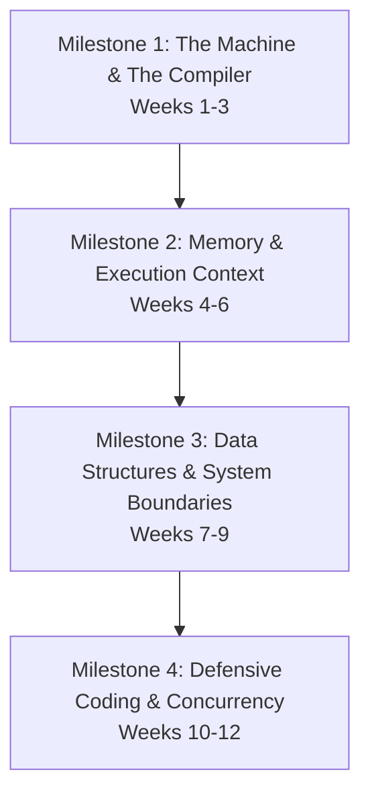

# Master Curriculum Roadmap: Professional C Systems Programming

This 12-week curriculum is a fast-paced, high-intensity systems engineering program. It is designed to take you from a basic programmer into a systems engineer who thinks at the hardware, compiler, and OS boundary.

---

## 🏛️ Chronological Milestones Overview

---

## 📅 Chronological Week-by-Week Breakdown

### 🔹 Milestone 1: The Machine & The Compiler
**Focus:** Understanding how code becomes machine instructions, how data is represented on CPUs, and how branches behave under load.

* **Week 01: Compiler Mechanics & Build Systems**
  * *Theme:* Preprocessing, Compilation, Assembly, Linking stages. GCC build control flags. Makefile writing.
  * *Assignment:* Build a multi-file library system with an incremental, self-dependency-tracking Makefile.
* **Week 02: Types, Representations, & CPU Realities**
  * *Theme:* Sign extension, float representation limits, bit shift properties, integer overflow detection.
  * *Assignment:* Write a robust floating-point decimal audit parser and safe bitwise-based numeric validator.
* **Week 03: Control Flow & Defensive Branching**
  * *Theme:* Cyclomatic complexity, branch optimization, infinite loop prevention, compiler optimizations.
  * *Assignment:* Create an optimized state-machine command parser with branch-free algorithms.
  * *Gatekeeper Check:* **Milestone 1 Core Gatekeeper Assignment.**

---

### 🔹 Milestone 2: Memory & Execution Context
**Focus:** Gaining precise mastery over application memory segment allocations, execution stacks, pointers, and custom struct packing.

* **Week 04: The Call Stack & Execution Frames**
  * *Theme:* Activation records, storage classes (`static`, `extern`, `register`), stack buffer safety.
  * *Assignment:* Construct an emulator of stack activation records with frame registers tracing.
* **Week 05: The Pointers Paradigm & Direct Memory Access**
  * *Theme:* Dereferencing mechanisms, pointer-decay, function pointers, event dispatch tables.
  * *Assignment:* Build a dynamic Event Dispatcher using a registered function pointer jump-table.
* **Week 06: Compound Data Structures & Layout**
  * *Theme:* Structure padding, memory alignments, unions, bitfields, binary network serialization.
  * *Assignment:* Implement a binary protocol pack/unpack engine with byte-alignment configurations.
  * *Gatekeeper Check:* **Milestone 2 Core Gatekeeper Assignment.**

---

### 🔹 Milestone 3: Data Structures & System Boundaries
**Focus:** Direct management of dynamic heap allocators, interacting with the operating system boundaries, and macro metaprogramming.

* **Week 07: Dynamic Memory Management (Heap)**
  * *Theme:* Heap layout, boundary tags, fragmentation. Custom Arena and Object Pool allocators.
  * *Assignment:* Design and write a custom **Memory Arena & Object Pool Allocator** without using `malloc` in active loops.
* **Week 08: Low-Level File I/O & Error Handling**
  * *Theme:* System calls vs Standard library, file descriptors, `errno` recovery, memory-mapped files (`mmap`).
  * *Assignment:* Build a low-level, high-performance file parsing engine using `mmap` and raw unbuffered I/O.
* **Week 09: Preprocessor Metaprogramming**
  * *Theme:* Preprocessor mechanics, macros hazards, X-Macros for boilerplate reduction, code generation.
  * *Assignment:* Implement a fully generic key-value map code-generator using X-Macros.
  * *Gatekeeper Check:* **Milestone 3 Core Gatekeeper Assignment.**

---

### 🔹 Milestone 4: Defensive Coding & Concurrency
**Focus:** Enforcing industrial safety standards, POSIX multi-threaded programming, and building high-performance production systems.

* **Week 10: Code Standards, Static Analysis, & Testing**
  * *Theme:* MISRA C critical guidelines, static analysis (`cppcheck`, `clang-tidy`), unit testing (`Unity`), coverage.
  * *Assignment:* Rewrite an unsafe library into a 100% MISRA-compliant, statically checked, fully unit-tested library.
* **Week 11: Multi-Threading, Race Conditions, & Atomic Safety**
  * *Theme:* POSIX threads (`pthreads`), race conditions, mutex lock disciplines, atomic safety, lock-free basics.
  * *Assignment:* Create a thread-safe Thread Pool Executor with work-stealing queue locks.
* **Week 12: Production-Grade Capstone Systems Project**
  * *Theme:* System assembly, performance audits, profiling (`gprof`), final coaching presentation.
  * *Assignment:* Write a fully featured, custom **Concurrent CLI Command Shell** or a thread-safe, memory-tracked key-value store database with zero leaks.
  * *Gatekeeper Check:* **Milestone 4 Final Graduation Audit.**

---

## 🏁 Advancement Directive
Before beginning, review the [c-milestone-scorecard.md](file:///home/siva/sivaramireddy/Project1/c-curriculum/c-milestone-scorecard.md) to understand the requirements of the Milestone Gates you must clear to graduate this curriculum!
