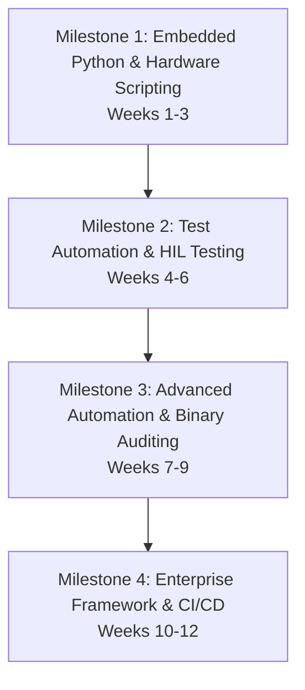

# Master Curriculum Roadmap: Python for Embedded Systems & Automation

This 12-week curriculum is a fast-paced, high-intensity software engineering program. It is designed to take you from a basic Python programmer into an elite test automation architect who builds robust Hardware-in-the-Loop (HIL) test suites, CI/CD pipelines, and binary parsing scripts.

---

## 🏛️ Chronological Milestones Overview

---

## 📅 Chronological Week-by-Week Breakdown

### 🔹 Milestone 1: Embedded Python & Hardware Scripting
**Focus:** Command-line wrapper tools, parsing binary frames over serial pipelines, and flashing and controlling Edge microcontrollers (MicroPython).

* **Week 01: Host Automation & CLI wrapping**
  * *Theme:* Subprocess redirection, defensive input execution, argument parsing, automated flashes.
  * *Assignment:* Build a robust CLI compiling and flashing wrapper that schedules compiler pipelines dynamically.
* **Week 02: Hardware Scripting & Serial Communications**
  * *Theme:* PySerial architectures, unbuffered byte reading, binary packing (`struct`), CRC validation.
  * *Assignment:* Write a packet serialization/deserialization telemetry reader parsing raw USB streams.
* **Week 03: MicroPython & Microcontroller Prototyping**
  * *Theme:* MicroPython execution context, GPIO, ADC, PWM registers control, interrupt safety, USB REPL.
  * *Assignment:* Construct an edge temperature logger running on simulated MCU hardware.
  * *Gatekeeper Check:* **Milestone 1 Core Gatekeeper Assignment.**

---

### 🔹 Milestone 2: Test Automation & Hardware-in-the-Loop (HIL)
**Focus:** Lab instrumentation wrapping, SCPI/VISA standards, structural pytest automation, and fault-injection HIL setups.

* **Week 04: Instrumentation Control (PyVISA & SCPI)**
  * *Theme:* Instrument control interfaces, PyVISA VISA resource maps, SCPI string tables, Raw TCP sockets.
  * *Assignment:* Design a complete, simulated Programmable Power Supply VISA driver wrapper.
* **Week 05: Test Framework Architecture (pytest & Fixtures)**
  * *Theme:* Setup/teardown isolation fixtures, dynamic discovery, test parametrizations, timeouts and retries.
  * *Assignment:* Write a multi-instrument hardware test suite using robust pytest dependencies.
* **Week 06: Hardware-in-the-Loop (HIL) & Fault Injection**
  * *Theme:* Relays control, automated fault injection, loop verification, asynchronous failure monitors.
  * *Assignment:* Build an automated fault-injection test system simulating real hardware failures.
  * *Gatekeeper Check:* **Milestone 2 Core Gatekeeper Assignment.**

---

### 🔹 Milestone 3: Advanced Automation & Binary Auditing
**Focus:** Parsing compiled firmware images, high-performance telemetry data logging, and metrics reporting dashboards.

* **Week 07: Firmware Analysis & Binary Parsing**
  * *Theme:* ELF binary parsing (`pyelftools`), compiler memory mapping, symbol address resolution.
  * *Assignment:* Write a static memory auditor checking ELF sections sizes and warning on stack overlaps.
* **Week 08: High-Performance Telemetry Data Logging**
  * *Theme:* Thread-safe serial readers, data queues, streaming file storage (CSV, Parquet, Pandas integration).
  * *Assignment:* Design a multi-threaded telemetry streaming data-logger that processes high-frequency feeds.
* **Week 09: Dynamic CLI Tools & Metrics Reporting**
  * *Theme:* Interactive CLI builders (`click`), automated report generators (PDF, HTML reports generation).
  * *Assignment:* Build a CLI metrics generator generating professional PDF test reports dynamically.
  * *Gatekeeper Check:* **Milestone 3 Core Gatekeeper Assignment.**

---

### 🔹 Milestone 4: Enterprise Framework & CI/CD
**Focus:** Design patterns, static type audits, Jenkins/GitHub Actions integrations, and graduation capstone execution.

* **Week 10: Python Code Quality, Typing, & Design Patterns**
  * *Theme:* Mypy static type hints, design patterns (Singleton, Factory, Device wrappers), Black/Ruff checkers.
  * *Assignment:* Refactor a legacy, untyped testing framework into a fully-typed, object-oriented framework.
* **Week 11: CI/CD Pipelines & Execution Orchestration**
  * *Theme:* Automated pipelines orchestration, parsing JUnit XML test outputs, Slack/email reports integrations.
  * *Assignment:* Construct an automated Jenkinsfile/GitHub Actions workflow orchestrating HIL tests on git push.
* **Week 12: Production-Grade Capstone HIL Framework Project**
  * *Theme:* Multi-threaded frameworks assembly, error diagnostics, final coaching portfolio presentations.
  * *Assignment:* Design a complete, modular, fully-typed, and multi-threaded **Hardware-in-the-Loop test automation framework** with zero errors.
  * *Gatekeeper Check:* **Milestone 4 Final Graduation Audit.**

---

## 🏁 Advancement Directive
Before beginning, review the [python-milestone-scorecard.md](file:///home/siva/sivaramireddy/Project1/python-automation-curriculum/python-milestone-scorecard.md) to understand the requirements of the Milestone Gates you must clear to graduate this curriculum!
