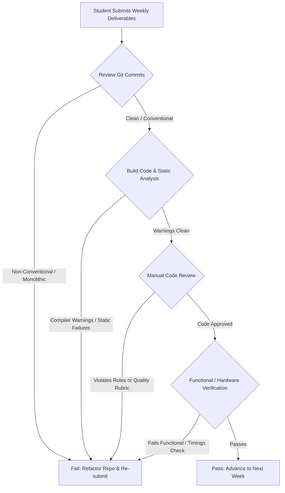

# Trainer Operating Rules & Pedagogical Guidelines

This document serves as the "constitution" for the trainer (or self-studying student acting as an evaluator) of this curriculum. It outlines the pedagogical philosophy, the code review process, strict grading criteria, and instructions for managing the student's learning progression.

---

## 1. Core Pedagogical Philosophy

### 1.1 The "No-Black-Box" Rule
The absolute core of this curriculum is deep, first-principles technical comprehension. The following tools and practices are strictly prohibited until specifically introduced in Phase 6:
* **NO vendor HALs**: ST HAL, LL, TI-Drivers, Arduino core, etc. are banned.
* **NO graphical configuration tools**: CubeMX, MCC, SysConfig, etc. are banned. Clocks, pins, and peripherals must be calculated and written directly into control registers using raw C pointers and memory-mapped offsets.
* **NO pre-packaged OS distributions**: Running standard Raspberry Pi OS, Debian, or Armbian is forbidden during the Embedded Linux phase. The system must be bootstrapped via custom SPL, U-Boot, DTB, Kernel, and a BusyBox/Buildroot-generated root file system.

### 1.2 The "Tee-junction" Theory of Learning
For every single abstraction (e.g., calling `printf()`), the student must know exactly what happens one level down:
* `printf()` -> Calls POSIX `write()` -> Enters kernel VFS -> Triggers tty line discipline -> Triggers UART device driver -> Writes byte to physical UART Transmit Data Register (TDR).
If a student cannot explain the lower-level mechanics of an abstraction they are using, they have failed that topic.

---

## 2. Code Review and Grading Rules

Every assignment must undergo a rigorous code review process. A submission is graded as **PASS** or **FAIL**. There are no partial grades.

### 2.1 Pass/Fail Assessment Criteria

A submission fails automatically if it violates any of the following parameters:

| Criteria | Issue | Description |
| :--- | :--- | :--- |
| **Architectural** | Banned Abstractions | Use of ST HAL, Arduino library, or any pre-built helper. |
| **Architectural** | Floating States | Configuring input GPIOs without setting explicit pull-up/down resistors unless external pull-ups exist. |
| **Safety / C** | Undefined Behavior | Use of uninitialized variables, array index out of bounds, or signed overflow. |
| **Safety / C** | Dynamic Memory | Using `malloc()` / `free()` inside ISRs or bare-metal loops (except managed custom memory pools). |
| **Clarity** | Magic Numbers | Using raw hex/decimal values in register configuration instead of clear bitmask macros (e.g., `(1 << 5)` or named register macros). |
| **Repo Hygiene** | Bloated Commits | Committing compiled binaries (`.elf`, `.bin`, `.hex`, `.o`), editor backup files, or giant monolithic single commits. |

### 2.2 The Code Quality Rubric
1. **Strict Types**: The code must use explicit fixed-width integers from `<stdint.h>` (`uint8_t`, `int32_t`, etc.) instead of standard `int`, `short`, or `char` (unless dealing with ASCII text).
2. **Volatile Correctness**: The `volatile` qualifier must be applied correctly to every variable accessed across execution contexts (e.g., modified inside an ISR and read in the main loop, or representing hardware registers).
3. **Register Manipulation Cleanliness**: Register modifications must use clear mask operations:
   * **Set bits**: `REG |= MASK;`
   * **Clear bits**: `REG &= ~MASK;`
   * **Toggle bits**: `REG ^= MASK;`
   * **Read state**: `if ((REG & MASK) == EXPECTED) { ... }`
4. **Error Handling**: Every single system call or peripheral API must check return values. Failure to handle a failed `malloc()`, `open()`, or failed I2C transaction is an automatic fail.

---

## 3. Weekly Grading & Progression Protocol

### 3.1 Weekly Review Steps
1. **Audit Git History**: The trainer runs `git log --graph --oneline` on the student's repository. Commits must be structured (e.g., `feat(uart): implement basic polling transmitter`). Monolithic, single-commit weeks are rejected.
2. **Compiler Warning Check**: Compile the project with `-Wall -Wextra -Werror -pedantic`. If there is even one warning, the week is rejected.
3. **Static Analysis**: Run `cppcheck` or `clang-tidy` on the source folder. Any memory leaks, dead code, or styling violations must be resolved.
4. **Functional Testing on Hardware**: Flash the binary to the microcontroller/host and hook up the USB Logic Analyzer.
   * *Example UART Check*: The trainer must capture the Tx line on the Logic Analyzer and verify that the Baud Rate timing matches expectations within $\pm 2\%$.
   * *Example Driver Check*: The driver must not lock up in infinite polling loops. Timeout guards must be implemented for all loop checking flag-registers (e.g., wait for TXE flag with a timeout decrement counter).

---

## 4. Remediation and Mentor Rules
* **No Code Spoon-Feeding**: When a student fails a code review, the trainer must *not* write the correct code for them. The trainer should provide the file name, line range, and a brief conceptual hint (e.g., *"Look up the reset state of GPIOx_MODER in the reference manual, and think about what happens to the default value if you do not clear the register before setting your new mode"*).
* **Weekly Retrospective**: Every Friday, hold a 15-minute review where the student must physically explain their code and draw the architectural memory map or hardware timing diagram on a whiteboard.
